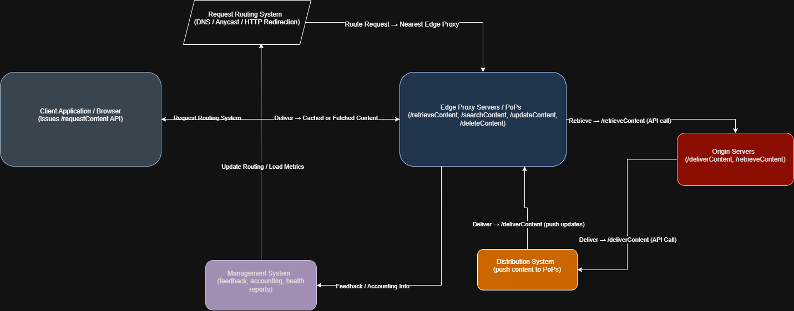

# CDN Architecture Overview

This document explains each element of the CDN design captured in `architecture_2.drawio.png`, outlining how requests flow through the system and what responsibilities each component carries.

## Request Lifecycle
- A user request starts at the **Client Application**, which reaches out to the CDN for content.
- The **Request Routing System** (DNS, Anycast, or HTTP redirection) steers the request toward the most appropriate edge location based on proximity and load.
- An **Edge Proxy / Point-of-Presence (PoP)** attempts to serve the object from cache, optionally checking neighboring peers before escalating to the origin.
- If the object is missing, the **Origin Servers** supply the definitive version, either directly to the proxy (pull) or via the distribution pipeline (push).
- The **Distribution System** disseminates updates from origins to proxies, while the **Management System** observes the entire fleet and feeds routing decisions with real-time health metrics.

## Component Responsibilities

### Client Application / Browser
- Entry point for user traffic; issues `/requestContent` calls to the CDN.
- Receives cached responses directly from nearby edge proxies, minimizing round-trips to origins.

### Request Routing System
- Directs users to the optimal PoP using DNS mapping, Anycast advertisements, or HTTP redirects.
- Consumes health and capacity signals from the management plane to avoid degraded nodes.
- Outputs the edge proxy endpoint that should handle the client’s next hop.

### Edge Proxy Servers / PoPs
- Core caching tier that stores, serves, and refreshes content close to users.
- Exposes APIs such as `/retrieveContent`, `/searchContent`, `/updateContent`, and `/deleteContent` to fetch or manage objects.
- Reports usage, cache hit rates, and health data back to the management system.
- Receives push updates from the distribution system to keep replicas current.

### Origin Servers
- Source of truth for all assets; maintains versioning and consistency.
- Supports `/retrieveContent` (pull model) and `/deliverContent` (push model) interactions.
- Supplies content when caches miss or distribution needs to seed new objects.

### Distribution System
- Propagates fresh content from origins to PoPs, preventing cache drift.
- Listens for `/deliverContent` events, then replicates objects to edge nodes.
- Reduces load on origins by pre-warming caches and enabling push-based updates.

### Management System
- Control plane that aggregates telemetry from proxies (traffic, cache hits, errors).
- Feeds routing decisions with availability and load metrics.
- Generates operational reports and orchestrates configuration updates for the fleet.

### Peer Sync (Optional)
- Allows peers within the same PoP to share objects via `/searchContent` and `/updateContent`.
- Improves cache hit ratios by checking sibling caches before reaching the origin.
- Reduces origin load and latency for hot or region-specific content.

## Operational Notes
- Combine push and pull models to balance freshness and on-demand scalability.
- Continuous telemetry from proxies enables adaptive routing and capacity planning.
- Optional peer synchronization is most valuable in high-traffic PoPs where objects replicate quickly across nodes.
- Component-level trade-offs live in `trade-offs.md`.
