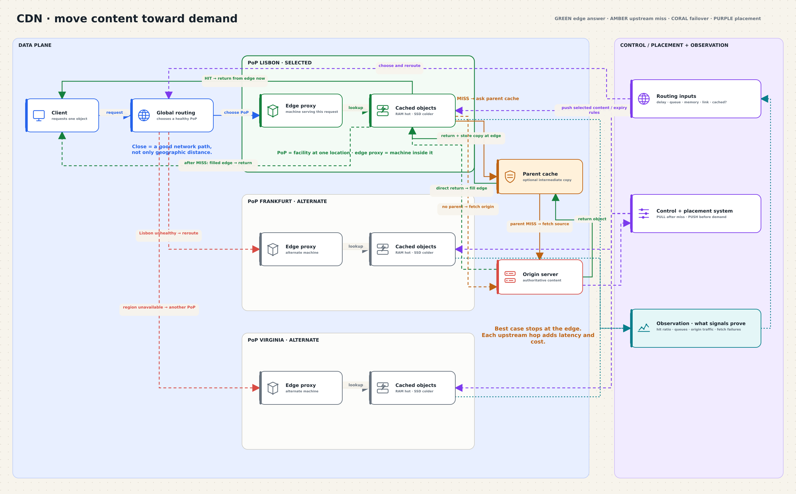

# Content Delivery Network

A CDN is a geographically distributed system that serves content from edge
locations closer to users. It moves data toward demand instead of sending every
request to one central origin.



[Open the editable System Canvas board](../drawing-platform/examples/cdn.system-canvas.json).

## Problem

A single origin becomes a latency bottleneck, repeats the same long-distance
transfer, and creates one large failure point. A CDN protects the origin by
letting edge proxies answer repeated requests.

## Core invariant

> Route each request to a healthy edge that can answer quickly, preferably from
> content already cached there.

“Close” means a good network path, not simply geographic distance. Routing
considers path latency, available capacity, health, and whether the object is
already cached. Load means growing queues, memory pressure, or a network link
nearing its limit—not CPU usage alone.

## Components

- **Client:** asks for an object.
- **Global routing:** chooses a point of presence (PoP).
- **PoP:** a facility at one location containing multiple machines.
- **Edge proxy/cache:** the machine that receives the request and stores copies.
- **Parent cache:** an optional intermediate proxy/cache protecting the origin.
- **Origin:** authoritative content source.
- **Control and placement system:** chooses push or pull placement, distributes
  policy, and observes health.

A CDN contains caches, but it is more than a cache: it also performs global
routing, placement, failover, and traffic absorption.

## Request paths

```text
hit
client → global routing → PoP → edge proxy → cache HIT
       → return object directly to client

miss with a parent cache
edge MISS → optional parent
parent HIT  → fill edge → return object to client
parent MISS → origin → fill parent + edge → return object to client

miss without a parent cache
edge MISS → origin → fill edge → return object to client

failure
selected PoP unhealthy → global routing → alternate healthy PoP
```

Every extra hop adds latency and system cost. The origin should be the exception
path, not the normal path.

See [trade-offs](./trade-offs.md) for push/pull placement, storage tiers, and
failure behavior. The older draw.io source remains at
[`architecture_2.drawio`](./architecture_2.drawio).
