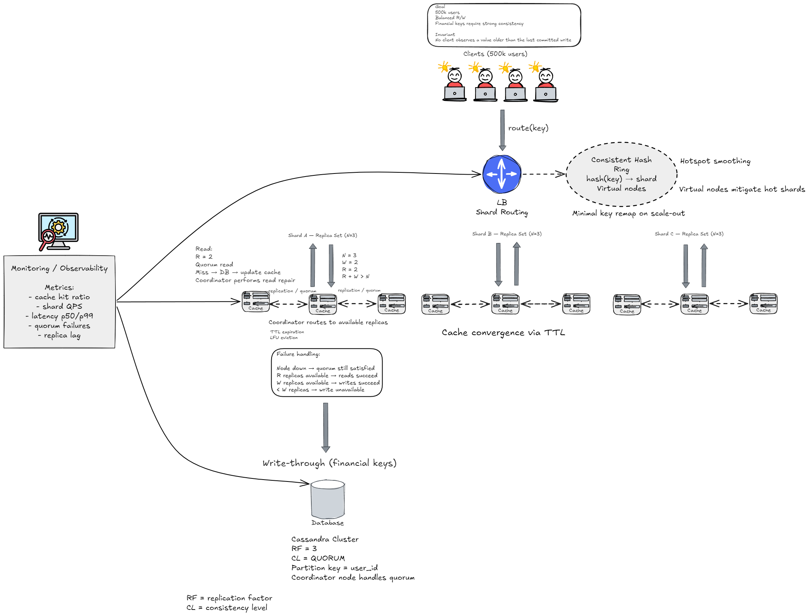

# Distributed Cache System

A distributed cache architecture designed for **~500k users** with **balanced read/write workloads** and **strong consistency for critical financial keys**.

The system uses **consistent-hash sharding** for horizontal scaling and **replicated cache nodes** to provide fault tolerance and high availability.

Reads and writes follow **quorum rules (R + W > N)** to guarantee consistency, while **write-through persistence** ensures durable storage in **Cassandra**. Cache behavior is managed through **TTL expiration** and **LFU eviction** to control memory usage and maintain healthy cache residency.

The architecture supports:

- **scalable key-based routing**
- **replica coordination**
- **durable persistence**
- **operational observability**

Key metrics include **cache hit ratio**, **shard load**, **latency**, and **replica lag**.

---

### Database Layer

**Cassandra acts as the source of truth for financial keys.**  
Data is partitioned by `user_id` and replicated across nodes to ensure durability and fault tolerance.

**Quorum reads and writes (`R=2`, `W=2`, `N=3`)** guarantee that clients never observe stale committed values.

Cassandra fits this architecture because it **natively supports partitioned data, replication, and quorum consistency**. Its **peer-to-peer design removes single leaders**, distributing writes across nodes and enabling **high write throughput while scaling horizontally**.

 

---

### Additional Documentation

- **tradeoffs.md** – design limits and system trade-offs  
- **architecture.png** – full system diagram