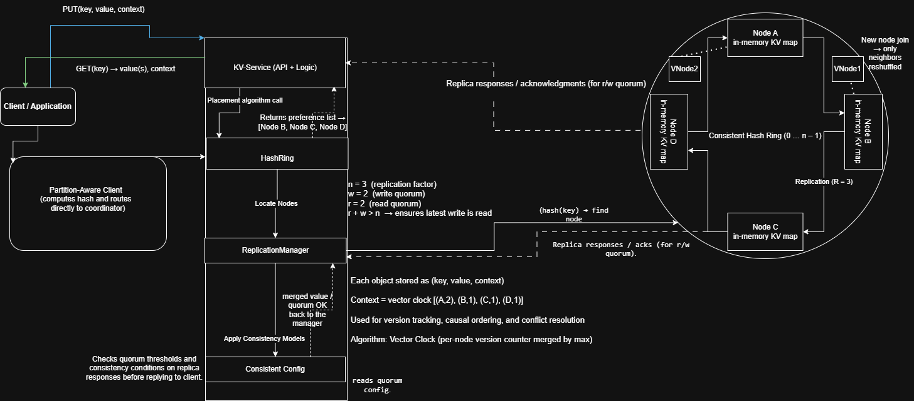

# Dynamo-Inspired Key-Value Store

Short notes on a Dynamo-style key-value store that stays available even when parts of the cluster misbehave.

## Snapshot

- Consistent hashing with virtual nodes keeps keys spread evenly across machines so operators avoid hotspot hunts.
- Tunable read/write counts (`r`, `w`, `n`) let teams trade a bit of freshness for lower latency (or the other way around) per request.
- Vector clocks catch conflicting versions; merges use `merge(A,B)[node] = max(A[node], B[node])`, which stays **commutative**, **associative**, and **idempotent** so conflict resolvers get the same result no matter the order.
- Sloppy quorum plus hinted handoff let nearby replicas accept writes while the preferred one is briefly offline so clients keep succeeding.
- Gossip membership and Merkle repair keep replicas aligned without a central controller, saving operators from babysitting membership.

## Architecture

The client hashes the key, contacts the first healthy replica in the preference list, and that coordinator writes to the next `n-1` clockwise neighbors so replicas stay in sync. If a node drops out, only its token ranges shift to those neighbors. When it comes back, it pulls those ranges home and replays any saved hints automatically, no operator action required.

### Request Cheatsheet

- **Write**: Coordinator waits for `w` acknowledgments; if a preferred replica is down, sloppy quorum picks the next healthy node and drops it a hint for catch-up so the caller still gets a success.
- **Read**: Coordinator pulls from `r` replicas and returns either one merged value or the sibling versions with their clocks so clients can reconcile.
- **Repair**: Background Merkle checks and hint cleanup stop replicas from drifting long term, sparing ops from manual repairs.

## Scaling

Add or remove capacity by assigning more virtual nodes. Only neighboring token ranges move, so operators can grow or shrink the ring without cluster-wide rebalancing.

_(Ring-scaling diagram forthcoming.)_

## More Detail

- [`kv-store-tradeoffs.md`](./kv-store-tradeoffs.md) — quick reference on the knobs behind these behaviors.
