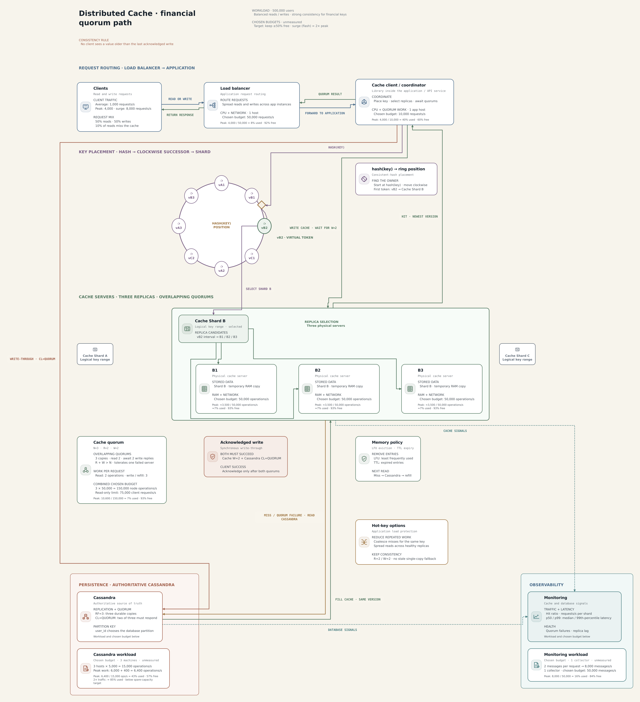

# Distributed Cache

This is the balanced read/write cache design for financial keys. It is separate
from the read-heavy social-feed cache.



[Open the editable board](../../drawing-platform/examples/distributed-cache.system-canvas.json).

## Design contract

- Goal: support 500,000 users with balanced reads and writes.
- Consistency: financial keys require strong consistency.
- Invariant: no client observes a value older than the last acknowledged write.

## Distributed-cache request path

```text
clients
→ load balancer
→ cache client / coordinator
→ consistent hash ring
→ cache shard
→ replica quorum
→ response
```

`hash(key)` marks one ring position. Traversal moves clockwise and stops at the
first virtual-node token; in the worked example that token is `vB2`. Under the
clockwise-successor convention, `vB2` owns the interval after its predecessor
and up to `vB2`, and maps that key range to logical Cache Shard B. Shard B then
selects the physical B1, B2, and B3 server replicas.

The cache uses three physical replicas per shard with `R=2`, `W=2`, and
`R + W > N`. Reads compare versioned responses and return the newest value.
Financial-key writes use synchronous write-through and are acknowledged only
after cache `W=2` and Cassandra `CL=QUORUM` succeed for the same version. A
partial failure is not acknowledged; the application invalidates or bypasses
the cache until Cassandra refreshes it.

A cache miss or cache-quorum failure makes the application read Cassandra at
`CL=QUORUM`, fill the selected cache shard with the returned version, and return
through the same cache client and load balancer. Cassandra is authoritative;
its selected configuration is `RF=3`, `CL=QUORUM`, partitioned by `user_id`.

The checked-in [`architecture.png`](../../distributed-cache/architecture.png) remains the original
source design. The generated PNG above, SVG, and editable JSON are its corrected
native versions.

See [trade-offs](./trade-offs.md) for quorum availability, memory policy, and
the monitoring signals retained from the source design.
