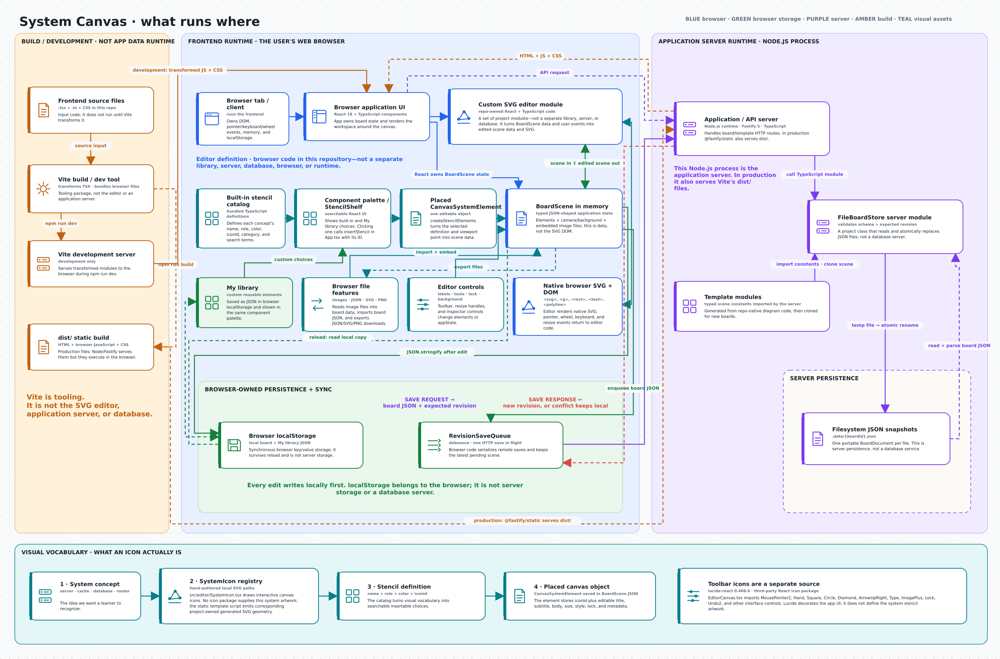

# System Canvas

System Canvas is a local-first whiteboard for explaining software and distributed
systems. Its editor is a native React and SVG canvas with an unbounded world-space
camera, editable routes, and a vendor-neutral geometric icon language.

The first release is deliberately single-user. Browser recovery is immediate;
a small Node API stores durable snapshots without blocking edits.

## Run locally

From the repository root:

```bash
cd drawing-platform
npm ci
npm run dev
```

Open `http://localhost:5173`. The API listens on `http://localhost:8787` and
stores snapshots under `.data/`.

For the production-shaped single-container path:

```bash
docker compose up --build
```

Then open `http://localhost:8787`.

## Verify

```bash
npm run lint
npm run typecheck
npm test
npm run build
```

Regenerate the checked-in teaching boards and matching SVG/PNG previews with:

```bash
npm run generate:designs
```

## What is included

- an infinite SVG canvas where a normal wheel pans, Ctrl/Cmd + wheel zooms at
  the cursor, Space-drag pans, and fit-all/fit-selection use visual content bounds
- click, Shift-toggle, and empty-canvas marquee selection; connector-aware group
  movement/resizing; content-aware width and height; parent-container growth;
  directly selectable wrapped text; shapes; and undo/redo
- `Layout spacing` controls for node distance and arrow clearance; `Tidy layout`
  applies both to the whole board as one undoable edit without selecting anything;
  sliders apply on release, and locked boards offer `Unlock all and tidy`
- `Clear board` empties the canvas with Undo and preserves saved server designs.
- `Reset design` restores the current built-in design from its latest template;
  Undo recovers edits and Redo reapplies the reset. Saved copies keep their board
  identity and name; previews remain temporary. Custom boards without a matching
  template are left intact.
- a readable component reference panel: select an element or click its `Details ↗`
  badge to consult architecture notes, open named references, and jump to connected
  components; `Edit details` opens the existing explicit-Apply form
- an explicit-Apply inspector for titles, subtitles, body/explanation, labels,
  font sizes, text alignment, image alt text, width, height, and optional
  architecture metadata; it closes with its button, Escape, or an outside click
- verified visual provenance in the inspector: actual source/package, icon ID,
  source file, asset type, category, and semantic reason, including icon-bearing
  logical partitions and consistent-hash virtual-node tokens
- element and whole-board locking; the two cache teaching templates start
  unlocked for direct editing, while locked boards can be unlocked one element
  at a time or all at once
- a browser-backed `My library` for saving customized system nodes, shapes, and
  text as reusable components
- thirty-six semantic system stencils across Routing, Services, Distributed
  Data, Systems, and Hardware
- custom canvas colors with plain, dotted, and grid backgrounds
- PNG, JPEG, WebP, and GIF insertion by browse, drop, or paste; images are
  embedded in the board and limited to 2 MB each
- immediate browser snapshots, manual `Save` to the server, explicit sync state, and
  optimistic revision conflicts
- schema-v2 JSON import/export, SVG/PNG export, and migration of supported
  schema-v1 and Excalidraw JSON
- independent template copies for the
  [KV store](../../drawing-platform/examples/kv-store.system-canvas.json),
  [CDN](../../drawing-platform/examples/cdn.system-canvas.json),
  [Social Feed — Distributed Cache](../../drawing-platform/examples/social-feed-distributed-cache.system-canvas.json),
  [balanced-R/W financial distributed cache](../../drawing-platform/examples/distributed-cache.system-canvas.json), and
  [System Canvas application architecture](../../drawing-platform/examples/system-canvas-app.system-canvas.json)

See [STACK.md](./STACK.md) for the technology choices and
[DESIGN.md](./DESIGN.md) for module boundaries and invariants. Every teaching
board also follows the repository-wide
[design standard](../DESIGN_STANDARD.md).

Saved and imported boards keep their authored positions on load. Automatic
placement runs for generated templates and explicit tidy actions. Templates use
the [shared layout standard](../../drawing-platform/shared/layout-standard.ts) for spacing,
measurement, route clearance, labels, and modest arrowheads; generated previews
use the same SVG element renderer as the editor.

Short `↗ Placement` and `↗ Monitoring` references identify the same component
drawn elsewhere on the board. They keep secondary paths near the relevant PoP
while preserving the canonical component and primary request journey.

## Consult component details

Select a component, or click its **Details ↗** badge above the component; click that badge again to close it. Badges
appear at readable zoom levels (45% and above), and on the selected element at
any zoom. The right panel shows a short role, a compact load/storage comparison, and actual connected components.
`More context` and `References` start collapsed for each selected component.
Context uses short sections; full calculations are available as a Markdown
reference download. Expanding notes never changes the canvas component's size.
Empty fields stay hidden. Locked components remain readable.

Use **Edit details → Architecture details → Reference links** to add links,
one per line: `Documentation | https://example.com/docs`. A bare HTTP(S) URL
also works. **Apply changes** validates and stores the edits locally; the header's
**Save** persists them to the server. **Cancel changes**, Escape, and closing
leave unapplied drafts out of the board. Links open in a separate tab. Source
paths remain literal unless they are full web URLs; attach a source link in
Reference links to make a repository file accessible.

Try the **System Canvas · website architecture** template and select
**Canvas editor · React**. Its reference panel includes implementation and
project Markdown links. Existing saved copies retain their authored metadata;
use the template preview to try the populated example.

Reference notes travel in JSON exports and reusable components. The reader and
Details badges are editor controls and are excluded from SVG/PNG artwork.

## Application architecture



The [editable architecture board](../../drawing-platform/examples/system-canvas-app.system-canvas.json)
documents **this website itself**, so a development team can recognize its parts
and their responsibilities. React creates and updates SVG elements from object
properties; the browser’s SVG renderer draws the canvas. Browser localStorage
and server JSON files preserve those properties so boards reopen as editable
objects. Vite and Fastify/Node.js appear on their relevant components, without
separate build or backend areas. API contracts and implementation rules stay in
the inspector and [development design](./DESIGN.md).

The custom SVG editor is not a third-party library, server, or database. It is
the frontend module [`src/editor/EditorCanvas.tsx`](../../drawing-platform/src/editor/EditorCanvas.tsx),
written in TypeScript and React. Vite compiles it to JavaScript; it runs in the
user's browser, turns scene data into ordinary SVG DOM elements, handles pointer
and keyboard input, and emits a changed `BoardScene` back to the React
application.

System-diagram artwork is hand-authored project SVG in
[`src/editor/SystemIcon.tsx`](../../drawing-platform/src/editor/SystemIcon.tsx). The stencil catalog
maps a concept to an `iconId`; the React `StencilShelf` renders those definitions
as the component palette; and `createStencilElements` turns a selected definition
into a placed `CanvasSystemElement` in `BoardScene`. The placed element stores the ID.
`lucide-react` is a separate third-party source used for toolbar and interface
controls, not for the system stencil artwork. An icon is a visual representation
of a runtime concept; it is not the runtime process, server, or database.

The backend is a separate Node.js application process written in TypeScript and
built with Fastify. It validates HTTP JSON requests and saves board snapshots as
atomic JSON files under `.data/`. Those files are persistence, not a database
server. Browser `localStorage` is a second, immediate recovery copy on the user's
machine. Neither storage layer draws or edits SVG.
