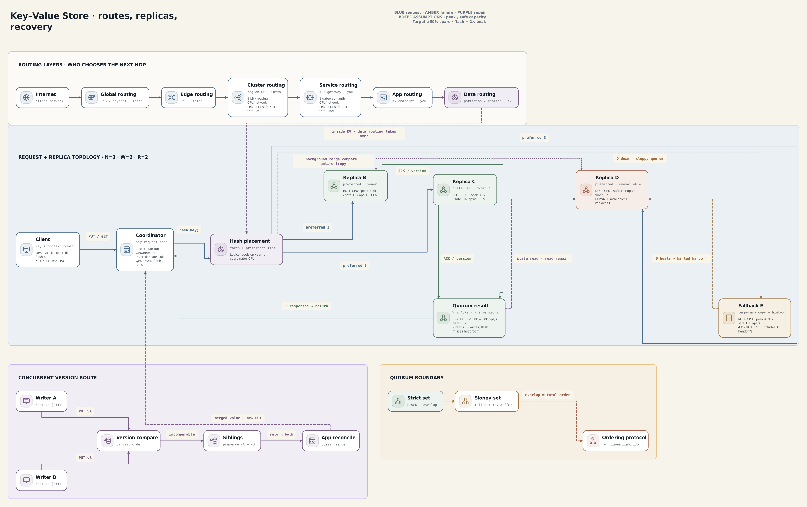

# Dynamo-Inspired Key-Value Store

A distributed key-value store hides placement, replication, failure handling, and repair behind a small `put(key, value)` / `get(key)` API. This scaffold explains the mechanism, not a production deployment.

[Open the editable System Canvas board](../../drawing-platform/examples/kv-store.system-canvas.json).

## The 60-second model

1. **Reach the service.** Global DNS, an edge/CDN, a cluster load balancer, a service gateway, and the application router may direct the request to a KV API process. Those layers are owned by application/platform infrastructure; they choose a region, service, and process—not the data replica.
2. **Route the key.** The KV coordinator owns data routing. It hashes the key, finds its token on a consistent-hash ring, and selects a preference list of distinct physical replicas. Virtual nodes spread token ranges more evenly and limit movement when capacity changes.
3. **Replicate.** In the teaching configuration, `N=3`: each value belongs on three preferred replicas. A write is sent to them and succeeds after `W=2` acknowledgements.
4. **Read and compare.** A read asks replicas and returns after `R=2` responses. Version metadata distinguishes a causally newer value from concurrent versions. Concurrent values remain **siblings** until application-specific reconciliation; a generic KV store cannot safely invent a merged value.
5. **Stay available, then converge.** With sloppy quorum, a healthy fallback may temporarily store a write for an unavailable preferred replica. **Hinted handoff** later forwards it home. **Read repair** fixes stale copies discovered by reads, while background **anti-entropy** compares replica ranges (often with Merkle trees) and repairs data that is rarely read.

## The important caveat

`R + W > N` (`2 + 2 > 3`) makes completed strict quorums for the same replica set overlap, improving the chance that a read observes an acknowledged write. It does **not** by itself provide linearizability: sloppy quorums may not overlap, operations may be concurrent, and version reconciliation permits siblings. Linearizability needs a protocol that enforces one real-time order per key, such as a leader/consensus design or an equivalent sequencing mechanism.

See [KV-store trade-offs](./kv-store-tradeoffs.md) for the knobs and failure
behavior, or the source notes in
[Execution Compression](<./🔑 Key-Value Store — Execution Compression.md>) for
the fuller reasoning behind this compact view.
