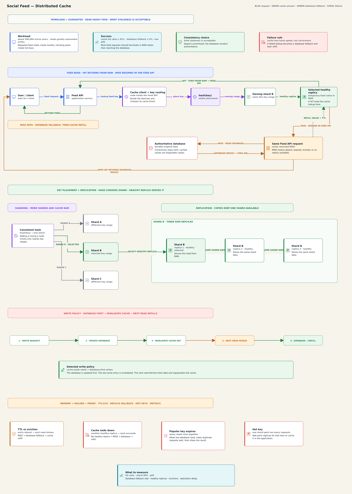

# Social Feed — Distributed Cache

This board applies distributed caching to a read-heavy social feed of roughly
500,000 active users. Repeated reads make RAM useful; trending posts create hot
keys; cache nodes can fail at any time.



[Open the editable board](../drawing-platform/examples/social-feed-distributed-cache.system-canvas.json).

## Design contract

- Feed reads greatly outnumber writes.
- Cache hit ratio target: at least 91%.
- Database fallback target: at most 9%.
- Slow-request tail: low p99 latency.
- Brief staleness is acceptable.
- The database owns durable correctness; cache replicas hold temporary copies.
- Cache failure may hurt speed, but must not change the correct answer.

## Read paths

```text
User / client
→ Feed API
→ cache client + key routing inside the Feed API
→ hash(key)
→ owning shard
→ selected healthy replica
```

Hit:

```text
RAM value → Feed API → User / client
```

Miss (absent, expired, evicted, or unavailable):

```text
cache MISS → Feed API → database → Feed API → User / client
                                  └→ refill cache + TTL
```

The database never sends a response directly to the client.

## Selected write policy

The database is updated first. The old cache entry is invalidated. The next read
fetches fresh data and repopulates the cache.

```text
write request → update database → invalidate key → next read misses → database result refills cache
```

See [trade-offs](./trade-offs.md) for the scoped failure decisions.
